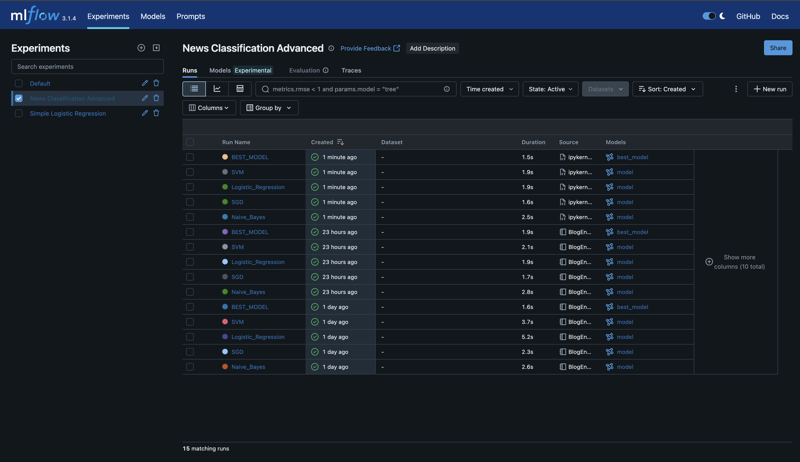
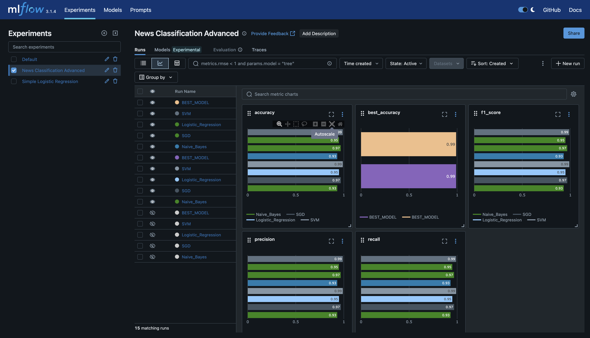
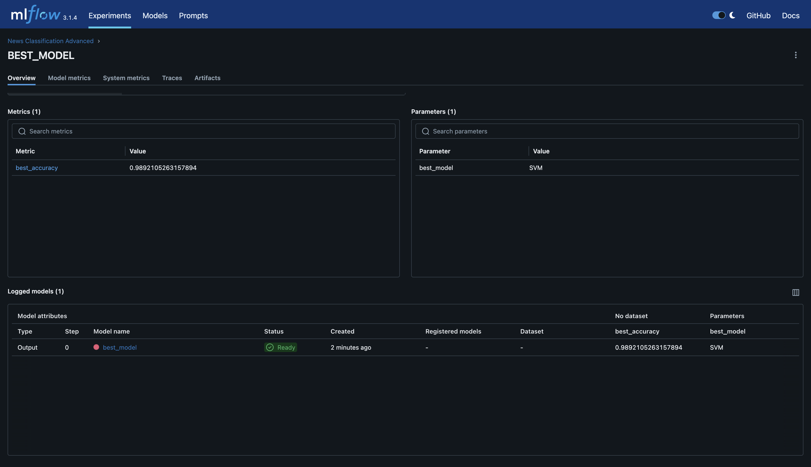
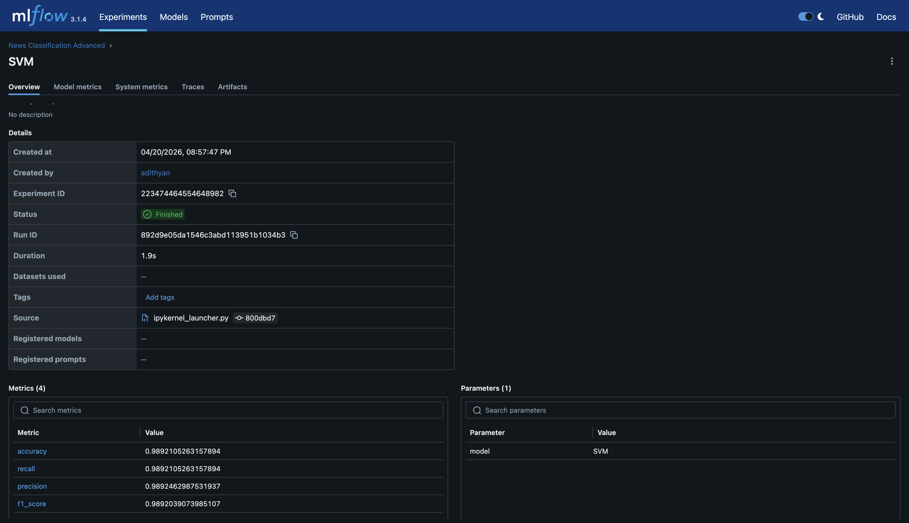
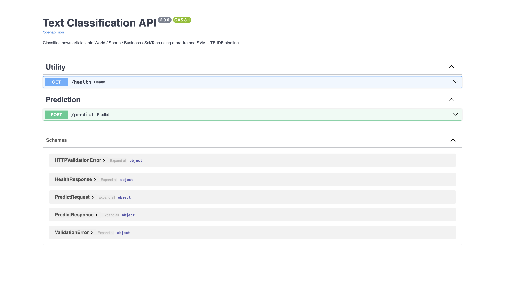
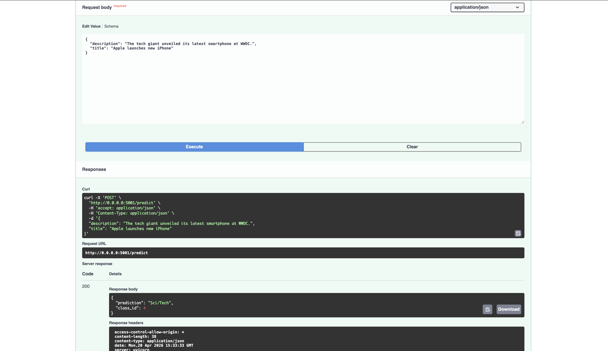

# 🧠 BlogEngine — MLOps Text Classification API

<div align="center">


**An end-to-end MLOps pipeline that automatically classifies blog articles into categories using a production-grade FastAPI service, trained and tracked with MLflow.**

</div>

---

## 📌 Project Overview

**BlogEngine** is a full-stack MLOps project that demonstrates best practices for taking a machine learning model from experimentation to production. The system ingests a news article's **title** and **description**, preprocesses the text, and predicts its category using a trained **Support Vector Machine (SVM)** model.

This project showcases:
- 🔬 **ML Experimentation** — Multiple models tracked and compared via MLflow
- ⚡ **Production API** — FastAPI REST service with Swagger docs
- 🐳 **Containerization** — Multi-stage Docker build for lean, secure deployment
- 🚀 **Cloud Deployment** — Hosted on Render, consumed by a Next.js frontend

---

## 🗂️ Project Structure

```
BlogEngine/
├── app.py                  # FastAPI application (entry point)
├── SVM.pkl                 # Trained SVM model artefact
├── tfidf.pkl               # Trained TF-IDF vectorizer artefact
├── BlogEngine.ipynb        # ML experimentation notebook (training + MLflow tracking)
├── requirements.txt        # Python dependencies
├── Dockerfile              # Multi-stage Docker build
├── docker-compose.yml      # Docker Compose configuration
├── .dockerignore           # Files excluded from Docker context
├── dataset/                # AG News training dataset
└── mlruns/                 # MLflow experiment tracking data
    ├── 179489153826527704/  # Experiment: Simple Logistic Regression
    └── 223474464554648982/  # Experiment: News Classification Advanced
```

---

## 🤖 Machine Learning Pipeline

### Dataset
The model was trained on the **AG News Corpus** — a benchmark news topic classification dataset with **4 categories** and 120,000+ samples.

| Class ID | Category  |
|----------|-----------|
| 1        | 🌍 World   |
| 2        | ⚽ Sports  |
| 3        | 💼 Business|
| 4        | 🔬 Sci/Tech|

### Preprocessing Pipeline
1. **Combine** — Concatenate `title` + `description`
2. **Lowercase** — Normalize text casing
3. **Clean** — Remove all non-alphabetic characters
4. **Tokenize** — Whitespace split
5. **Stopword Removal** — Remove English stopwords (NLTK)
6. **Vectorize** — Apply TF-IDF transformation

### Models Evaluated (MLflow Tracked)

| Model | Accuracy | F1 Score |
|-------|----------|----------|
| Naïve Bayes | 90.32% | 90.29% |
| Naïve Bayes (tuned) | 93.14% | 93.13% |
| SGD Classifier | 91.08% | 91.04% |
| SGD Classifier (tuned) | 96.83% | 96.82% |
| Logistic Regression | 91.83% | 91.81% |
| Logistic Regression (tuned) | 94.95% | 94.93% |
| **SVM** | 91.89% | 91.88% |
| **SVM (tuned) ✅ BEST** | **98.92%** | **98.92%** |

> ✅ The **tuned SVM** was selected as the production model with **98.92% accuracy**.

---

## 📊 MLflow Experiment Tracking

MLflow was used to track all experiments, log metrics, and register the best model.

### Experiment: `News Classification Advanced`



### All Runs Comparison



### Best Model — SVM Run Details



### Metrics Bar Chart / Comparison Chart



---

## ⚡ FastAPI Service

### API Endpoints

| Method | Endpoint   | Description                              |
|--------|------------|------------------------------------------|
| `GET`  | `/health`  | Liveness check — returns `{"status":"ok"}` |
| `POST` | `/predict` | Classify a news article by title + description |
| `GET`  | `/docs`    | Interactive Swagger UI                   |
| `GET`  | `/redoc`   | ReDoc API documentation                  |

### Interactive Swagger UI (FastAPI /docs)



### Example — POST /predict (Try It Out)



### Request & Response Schema

**Request** — `POST /predict`
```json
{
  "title": "Apple launches new iPhone",
  "description": "The tech giant unveiled its latest smartphone at WWDC."
}
```

**Response** — `200 OK`
```json
{
  "prediction": "Sci/Tech",
  "class_id": 4
}
```

**Health Check** — `GET /health`
```json
{
  "status": "ok"
}
```

**Error** — `400 Bad Request`
```json
{
  "detail": "Both 'title' and 'description' are empty. At least one must be provided."
}
```

---

## 🐳 Docker & Containerization

The application uses a **multi-stage Docker build** to minimize the final image size and harden security:

| Stage | Base Image | Purpose |
|-------|-----------|---------|
| `builder` | `python:3.11-slim` | Install dependencies, pre-download NLTK data |
| `runtime` | `python:3.11-slim` | Lean final image, non-root user |

### Quick Start with Docker

```bash
# Build and run with Docker Compose (recommended)
docker compose up --build

# Or build and run manually
docker build -t blogengine-api:latest .
docker run -p 5001:5001 blogengine-api:latest
```

The API will be available at:
- **API**: `http://localhost:5001`
- **Swagger Docs**: `http://localhost:5001/docs`
- **ReDoc**: `http://localhost:5001/redoc`

### Health Check (built-in)

Docker Compose includes a built-in health check that pings `/health` every 30 seconds and restarts the container if it becomes unhealthy.

---

## 🛠️ Local Development Setup

### Prerequisites
- Python 3.11+
- pip

### Steps

```bash
# 1. Clone the repository
git clone https://github.com/your-username/BlogEngine.git
cd BlogEngine

# 2. Create a virtual environment
python -m venv venv
source venv/bin/activate   # Windows: venv\Scripts\activate

# 3. Install dependencies
pip install -r requirements.txt

# 4. Run the FastAPI server
python app.py
```

The server starts at `http://localhost:5001`.

### View MLflow Experiments Locally

```bash
# Install MLflow (if not already installed)
pip install mlflow

# Launch the MLflow UI
mlflow ui --backend-store-uri file:///$(pwd)/mlruns --port 5000
```

Navigate to `http://localhost:5000` to explore all tracked experiments and runs.

---

## 📦 Dependencies

| Package | Version | Purpose |
|---------|---------|---------|
| `fastapi` | ≥ 0.111.0 | Web framework |
| `uvicorn` | ≥ 0.29.0 | ASGI server |
| `pydantic` | ≥ 2.0.0 | Data validation |
| `scikit-learn` | ≥ 1.4.0 | SVM model & TF-IDF |
| `joblib` | ≥ 1.3.0 | Model serialization |
| `nltk` | ≥ 3.8.0 | Stopword removal |

---

## 🚀 Deployment

The API is deployed on **Render** and consumed by the **Next.js blog frontend** hosted on **Vercel**.

```
Frontend (Next.js / Vercel)
        │
        │  POST /predict
        ▼
Backend (FastAPI / Render)
        │
        │  loads
        ▼
SVM.pkl + tfidf.pkl
```

The frontend uses the prediction endpoint to **automatically classify** a blog post's category when the author enters a title and description — eliminating manual category selection.

---

## 🔒 Security Notes

- The Docker container runs as a **non-root user** (`appuser`) for security hardening.
- CORS is currently set to `allow_origins=["*"]` — restrict to specific domains in production.
- Model artefacts (`SVM.pkl`, `tfidf.pkl`) are baked into the container image for self-contained, offline inference.

---

## 📈 MLOps Workflow Summary

```
Data (AG News)
     │
     ▼
Preprocessing (clean → tokenize → stopwords → TF-IDF)
     │
     ▼
Experiment Tracking (MLflow)
  ├── Naïve Bayes
  ├── SGD Classifier
  ├── Logistic Regression
  └── SVM  ← Best Model (98.92% accuracy)
     │
     ▼
Model Registry (MLflow → best model saved as SVM.pkl + tfidf.pkl)
     │
     ▼
REST API (FastAPI + uvicorn)
     │
     ▼
Docker Container (Multi-stage build → Render Cloud)
     │
     ▼
Blog Frontend (Next.js → auto-classifies posts)
```

---

## 👤 Author

**Adithyan**
- Built as an end-to-end MLOps project demonstrating the full lifecycle from data to production.

---

## 📄 License

This project is licensed under the MIT License.
